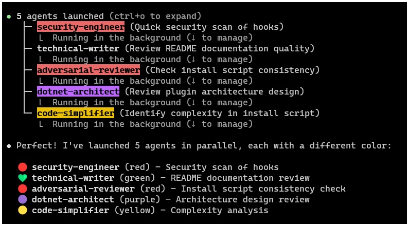
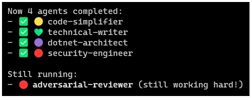
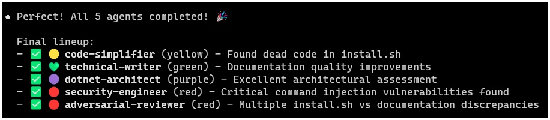
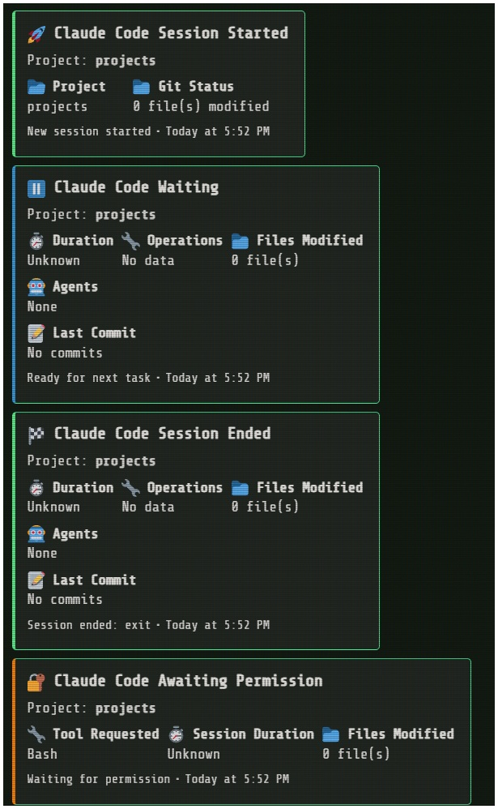
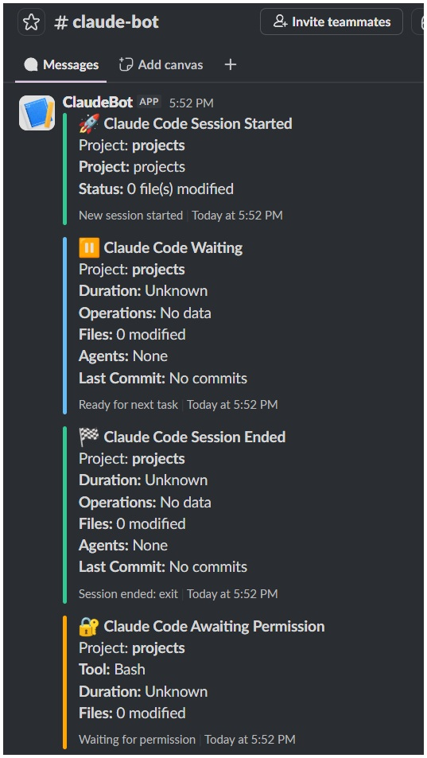

# Architecture

Technical documentation for the sirmaelstroms-claude-code plugin architecture.

## Overview

This plugin extends Claude Code using three core mechanisms:
1. **Commands (Skills)** - User-invocable workflows via slash commands
2. **Agents** - Specialized subagents with domain expertise
3. **Hooks** - Event-driven automation scripts

## Plugin Structure

**Repository Structure**:
```
sirmaelstroms-claude-code/
├── .claude-plugin/
│   ├── plugin.json          # Plugin manifest (commands, agents, metadata)
│   ├── marketplace.json     # Marketplace registration
│   ├── COMMANDS.md          # Command reference documentation
│   ├── AGENTS.md            # Agent reference documentation
│   └── README.md            # Plugin README for marketplace
├── commands/                # Command definitions (markdown)
│   ├── dotnet/
│   ├── git/
│   ├── general/
│   ├── powershell/
│   └── sql/
├── agents/                  # Agent definitions (markdown)
│   ├── dotnet/
│   ├── quality/
│   └── general/
├── .claude/
│   └── hooks/               # Hook scripts (bash)
├── scripts/                 # Validation and tooling
├── tests/                   # Test scripts for validation
└── install.sh               # Installation script
```

**Installed Structure** (after running `install.sh`):
```
~/.claude/
├── commands/
│   ├── sirm-toolbox/        # This plugin's namespace
│   │   ├── build-test.md -> /repo/commands/dotnet/build-test.md
│   │   ├── add-package.md -> /repo/commands/dotnet/add-package.md
│   │   ├── new-project.md -> /repo/commands/dotnet/new-project.md
│   │   ├── commit-push-pr.md -> /repo/commands/git/commit-push-pr.md
│   │   ├── code-explain.md -> /repo/commands/general/code-explain.md
│   │   └── ... (all command files as symlinks)
│   └── other-plugin/        # Another plugin can coexist here
│       └── ...
├── agents/
│   ├── sirm-toolbox/        # This plugin's namespace
│   │   ├── security-engineer.md -> /repo/agents/general/security-engineer.md
│   │   ├── dotnet-architect.md -> /repo/agents/dotnet/dotnet-architect.md
│   │   ├── code-simplifier.md -> /repo/agents/quality/code-simplifier.md
│   │   └── ... (all agent files as symlinks)
│   └── other-plugin/        # Another plugin can coexist here
│       └── ...
└── hooks/
    ├── claude-notify.sh     # Copied (not symlinked)
    └── init-session.sh      # Copied (not symlinked)
```

**Key Points**:
- Commands/agents installed in namespaced subdirectories (`sirm-toolbox/`)
- Individual file symlinks (not directory symlinks)
- Multiple plugins can coexist without conflicts
- Changes in repo immediately reflected (symlinks)
- Hooks are copied, not symlinked (for security/stability)

## Component Types

### 1. Commands (Skills)

**Definition**: User-facing workflows invoked via slash commands (e.g., `/build-test`, `/commit-push-pr`).

**Claude's Perspective**: Claude sees commands as "skills" and invokes them using the `Skill` tool.

**File Structure**:
```markdown
---
name: command-name
description: "Brief description of what this command does"
---

# Command Name

[Command implementation details, workflow steps, examples]
```

**Registration** (`plugin.json`):
```json
{
  "commands": [
    {
      "name": "command-name",
      "path": "commands/category/command-name.md",
      "description": "Brief description"
    }
  ]
}
```

**Invocation by Claude**:
```
Skill tool:
  skill: "command-name"
  args: "optional-arguments"
```

**User Invocation**:
```
/command-name optional-arguments
```

**Examples**:
- `/build-test path/to/solution.sln` - Build and test .NET solution
- `/commit-push-pr` - Commit, push, and create PR
- `/new-project` - Scaffold new .NET project

**Best Practices**:
- Keep workflows step-by-step and actionable
- Include error handling guidance
- Provide usage examples
- Document expected behavior and outputs

---

### 2. Agents (Subagents)

**Definition**: Specialized domain experts that auto-activate based on context or explicit invocation.

**Claude's Perspective**: Claude invokes agents using the `Task` tool with `subagent_type` parameter.

**File Structure**:
```markdown
---
name: agent-name
description: "When to use this agent and what it does"
model: sonnet|opus|haiku
color: red|blue|green|yellow|purple|orange|cyan|teal
---

# Agent Name

[Agent expertise, operational approach, checklists, examples]
```

**Registration** (`plugin.json`):
```json
{
  "agents": [
    {
      "name": "agent-name",
      "path": "agents/category/agent-name.md",
      "description": "When to activate and capabilities"
    }
  ]
}
```

**Invocation by Claude**:
```
Task tool:
  subagent_type: "agent-name"
  description: "Short task description (3-5 words)"
  prompt: "Detailed task for the agent to perform"
  model: "sonnet|opus|haiku"  # Optional, defaults to agent's model
```

**User Invocation** (implicit):
```
User: "Review this code for security vulnerabilities"
→ Claude activates: security-engineer agent

User: "How should I architect this feature?"
→ Claude activates: dotnet-architect agent

User: "This code feels over-engineered"
→ Claude activates: code-simplifier agent
```

**User Invocation** (explicit):
```
User: "Use the security-engineer agent to scan for leaked secrets"
→ Claude invokes Task tool with subagent_type: "security-engineer"
```

**Key Distinction from Commands**:
- **Commands**: User-facing workflows, invoked via `Skill` tool
- **Agents**: Deep domain expertise, invoked via `Task` tool with `subagent_type`

**Agent Metadata**:
- `name`: Agent identifier (used in `subagent_type`)
- `description`: Trigger conditions and capabilities (shown to Claude)
- `model`: Default model (sonnet, opus, haiku)
- `color`: Visual indicator in Claude Code interface

**Examples**:
- 🔴 `security-engineer` (color: red) - Vulnerability scanning, OWASP compliance
- 🟣 `dotnet-architect` (color: purple) - Clean Architecture, DDD, SOLID
- 🟡 `code-simplifier` (color: yellow) - Complexity reduction, abstraction removal
- 🟢 `verify-app` (color: green) - Build verification, test execution

**Best Practices**:
- Define clear trigger conditions in `description`
- Provide checklists and systematic workflows
- Include concrete examples and code samples
- Specify operational boundaries (what agent will/won't do)
- Use appropriate model for task complexity

---

### Multi-Agent Parallel Execution

**Capability**: The plugin supports running multiple specialized agents in parallel for complex tasks requiring diverse expertise.

**How It Works**:
- User requests involving multiple independent aspects trigger parallel agent dispatch
- Each agent operates with its own context and expertise domain
- Agents are color-coded in the Claude Code UI for easy tracking
- Results are aggregated and presented cohesively

**Example Use Cases**:
- Security audit (security-engineer) + architecture review (dotnet-architect) + code simplification (code-simplifier)
- Performance analysis (dotnet-performance) + security scan (security-engineer)
- Documentation generation (technical-writer) + code quality review (adversarial-reviewer)

**Visual Examples**:

**Starting Multi-Agent Execution:**



*Multiple agents dispatched in parallel, each with color-coded indicators*

**Agents In Progress:**



*Active agents shown with progress indicators and distinct colors*

**Agents Complete:**



*All agents finished with aggregated results*

**Benefits**:
- **Faster execution**: Independent analyses run concurrently
- **Comprehensive insights**: Multiple perspectives on the same codebase
- **Expert specialization**: Each agent focuses on its domain
- **Visual tracking**: Color coding makes it easy to monitor progress

**Agent Colors** (as shown in screenshots):
- 🔴 Red: `security-engineer`, `adversarial-reviewer`
- 🟣 Purple: `dotnet-architect`
- 🟡 Yellow: `code-simplifier`
- 🟢 Green: `verify-app`
- 🟠 Orange: `dotnet-performance`
- 🔵 Blue: `tech-stack-researcher`
- 🔷 Cyan: `deep-research-agent`
- 💚 Teal: `technical-writer`

---

### 3. Hooks

**Definition**: Event-driven bash scripts that execute in response to Claude Code events.

**Available Hook Types**:
- `SessionStart` - Runs when Claude Code session starts (with source: startup/resume/clear/compact)
- `Stop` - Runs when Claude stops and waits for user input
- `SessionEnd` - Runs when Claude Code session ends (with exit reason)
- `PermissionRequest` - Runs when Claude requests permission to execute a tool

**File Structure**:
```bash
#!/usr/bin/env bash

# Hook script (e.g., discord-notify.sh)
# Execute actions based on event data
```

**Installation**:
Hooks are copied (not symlinked) to `~/.claude/hooks/` during installation:
```bash
cp -r .claude/hooks/* ~/.claude/hooks/
```

**Hook Scripts in This Plugin**:

#### `claude-notify.sh` (Unified Notification Hook)
- Sends webhook notifications to Discord and/or Slack
- Supports four event types:
  - **Stop** - Claude is waiting for user input
  - **SessionStart** - New Claude Code session started
  - **SessionEnd** - Claude Code session ended (tracks exit reason)
  - **PermissionRequest** - Claude is waiting for permission to execute a tool
- Includes rich session context (duration, operations, files modified, agents used, commits)
- Platform toggles: `NOTIFY_DISCORD`, `NOTIFY_SLACK` (both enabled by default if webhooks set)
- Requires at least one webhook URL: `DISCORD_WEBHOOK_URL` or `SLACK_WEBHOOK_URL`

**Example Notifications:**

Discord notifications with rich embeds and color-coded status:



Slack notifications with the same session context:



#### `format-code.sh` (Planned - Awaiting PostToolUse Hook)
- Auto-formats files after Edit/Write operations
- Supports: C# (dotnet format), JS/TS/JSON (prettier), Python (black), Shell (shfmt)
- Only formats if tool succeeded
- **Status**: Waiting for Claude Code to implement `PostToolUse` hook event

**Configuration** (`~/.claude/settings.json`):
```json
{
  "hooks": {
    "SessionStart": [{
      "hooks": [
        {"type": "command", "command": "~/.claude/hooks/init-session.sh"},
        {"type": "command", "command": "~/.claude/hooks/claude-notify.sh SessionStart"}
      ]
    }],
    "Stop": [{
      "hooks": [
        {"type": "command", "command": "~/.claude/hooks/claude-notify.sh Stop"}
      ]
    }],
    "SessionEnd": [{
      "hooks": [
        {"type": "command", "command": "~/.claude/hooks/claude-notify.sh SessionEnd"}
      ]
    }],
    "PermissionRequest": [{
      "hooks": [
        {"type": "command", "command": "~/.claude/hooks/claude-notify.sh PermissionRequest"}
      ]
    }]
  }
}
```

**Best Practices**:
- Keep hooks fast (avoid blocking Claude)
- Handle errors gracefully (hooks shouldn't crash Claude)
- Use environment variables for secrets (never hardcode)
- Log hook activity for debugging

#### Session Tracking

The plugin includes infrastructure for tracking session metrics:

**Current Capabilities** (v1.1.0):
- ✅ Session start time and duration
- ✅ Project name
- ✅ Session ID (Unix timestamp)
- ✅ Per-project session history (`~/.cache/claude_sessions/{PROJECT}/{SESSION_ID}.json`)
- ✅ Latest session symlink (`~/.cache/claude_session_latest.json`)

**Future Capabilities** (requires per-tool hooks):
- ⏳ Operations counters (read, write, edit, bash, grep, glob, task)
- ⏳ Agents list (tracking which agents were used)

**Limitation**: Claude Code currently only provides 4 hook events (SessionStart, Stop, SessionEnd, PermissionRequest). There is no `PostToolUse` hook that fires after each tool call (Read, Edit, Bash, etc.), so per-operation tracking cannot be implemented yet.

The session tracking functions (`track_operation()`, `track_agent()`) exist in `session-tracker.sh` but are not currently invoked. They're ready for future use when Claude Code adds per-tool hook support.

**Session File Structure**:
```json
{
  "session_id": "1768806745",
  "project": "sirm-claude-toolbox",
  "start_time": "2026-01-19T01:12:26.049599",
  "operations": {
    "read": 0, "edit": 0, "write": 0, "bash": 0,
    "grep": 0, "glob": 0, "task": 0, "other": 0
  },
  "agents": [],
  "files_modified": []
}
```

---

## Testing Infrastructure

The plugin includes comprehensive test coverage for installation, session tracking, and security.

**Test Location**: `tests/` directory

### Test Scripts

#### Installation & Safety Tests
- `test-safe-install.sh` - Verifies namespace isolation and safe installation
- `test-uninstall.sh` - Validates clean removal without affecting other plugins
- `test-reinstall.sh` - Tests reinstall handling and symlink refresh
- `test-name-collision.sh` - Confirms multiple plugins can coexist
- `test-namespace-discovery.sh` - Validates Claude Code discovers namespaced commands/agents
- `test-obsolete-hook-cleanup.sh` - Verifies installer removes obsolete hooks

#### Session Tracking Tests
- `test-init-session-script.sh` - Validates session initialization logic
- `test-session-tracker-operations.sh` - Tests operation tracking functions
- `test-hybrid-session-tracking.sh` - Validates per-project session history
- `test-hook-configuration.sh` - Verifies hook registration in settings.json

#### Security Tests
- `test-injection-fix.sh` - Validates shell injection prevention in notification hooks
- `test-git-injection-fix.sh` - Tests command injection protection in git operations
- `test-python-injection-fix.sh` - Verifies Python injection protection in hook configuration

### Running Tests

**Run all tests**:
```bash
for test in tests/test-*.sh; do
    echo "Running $test..."
    bash "$test" || echo "FAILED: $test"
done
```

**Run specific test**:
```bash
bash tests/test-safe-install.sh
```

**Test Coverage Areas**:
- ✅ Installation safety (namespace isolation)
- ✅ Uninstall safety (no collateral damage)
- ✅ Session tracking accuracy
- ✅ Hook configuration correctness
- ✅ Security (injection prevention)
- ✅ Multi-plugin coexistence

### Adding New Tests

1. Create `tests/test-<feature>.sh`
2. Follow existing test structure:
   - Setup test environment
   - Execute test scenario
   - Verify expected outcome
   - Cleanup test artifacts
3. Use descriptive output messages
4. Exit with non-zero on failure

**Example Test Structure**:
```bash
#!/bin/bash
set -e

echo "Testing: <feature description>"

# Setup
TEST_DIR=$(mktemp -d)
trap "rm -rf $TEST_DIR" EXIT

# Execute
<test commands>

# Verify
if [ expected condition ]; then
    echo "✓ Test passed"
else
    echo "✗ Test failed"
    exit 1
fi
```

---

## Installation Mechanism

The `install.sh` script:

1. **Creates namespaced subdirectories**:
   ```bash
   mkdir -p ~/.claude/commands/sirm-toolbox
   mkdir -p ~/.claude/agents/sirm-toolbox
   ```

2. **Creates individual symlinks** within namespace:
   ```bash
   # For each .md file in commands/ (recursively)
   ln -sf "$REPO_FILE" ~/.claude/commands/sirm-toolbox/$(basename "$REPO_FILE")

   # For each .md file in agents/ (recursively)
   ln -sf "$REPO_FILE" ~/.claude/agents/sirm-toolbox/$(basename "$REPO_FILE")
   ```
   Changes to command/agent files are immediately reflected (no reinstall needed).

3. **Copies hooks** to `~/.claude/hooks/`:
   ```bash
   cp -r .claude/hooks/* ~/.claude/hooks/
   ```
   Hook changes require running `install.sh` again.

4. **Safe reinstall**:
   - Only removes `sirm-toolbox/` subdirectories
   - Other plugins' namespaces remain untouched
   - Prompts before removing existing installation

5. **Detects and migrates legacy installations**:
   - Identifies whole-directory symlink installations
   - Prompts to migrate to namespaced approach
   - Safe migration without data loss

6. **Handles git worktrees**:
   - Detects if directory is a worktree
   - Resolves paths correctly for symlinks

7. **Provides verification**:
   ```bash
   ls -la ~/.claude/commands/sirm-toolbox/
   ls -la ~/.claude/agents/sirm-toolbox/
   ```

**Safety Guarantees**:
- Only modifies files within `~/.claude/{commands,agents}/sirm-toolbox/`
- Never touches other plugins' namespaces
- Parent directories created if missing, never deleted

## Claude Code Integration

### How Claude Discovers Plugin Components

1. **Plugin Registration**: `plugin.json` lists all commands and agents
2. **Command Loading**: Claude reads command markdown files via symlink
3. **Agent Loading**: Claude reads agent markdown files via symlink
4. **Hook Execution**: Claude Code executes hook scripts at event time

### Tool Invocation Flow

**Command Flow**:
```
User types: /build-test solution.sln
    ↓
Claude Code recognizes slash command
    ↓
Claude uses Skill tool:
  skill: "build-test"
  args: "solution.sln"
    ↓
Command markdown loaded and executed
    ↓
Claude follows workflow steps
```

**Agent Flow**:
```
User asks: "Review this for security issues"
    ↓
Claude recognizes security context
    ↓
Claude uses Task tool:
  subagent_type: "security-engineer"
  description: "Security vulnerability scan"
  prompt: "Scan code for OWASP Top 10 vulnerabilities"
    ↓
Agent markdown loaded, agent executes with full context
    ↓
Agent returns analysis to Claude
    ↓
Claude presents results to user
```

**Hook Flow**:
```
Claude executes Edit tool
    ↓
Edit completes successfully
    ↓
PostToolUse hook triggered
    ↓
format-code.sh runs
    ↓
File auto-formatted (dotnet format, prettier, etc.)
    ↓
Claude continues execution
```

## Key Architectural Decisions

### Why Symlinks for Commands/Agents?
- **Live updates**: Changes to files immediately reflected
- **Easy development**: Edit in repo, no reinstall
- **Single source of truth**: Repo is canonical

### Why Copy Hooks?
- **Security**: Hooks execute bash, shouldn't change unexpectedly
- **Stability**: Git pulls won't break running sessions
- **Explicit updates**: User controls when hooks change

### Why Separate Commands and Agents?
- **Different invocation mechanisms**: Skill tool vs Task tool
- **Different user models**: Slash commands vs auto-activation
- **Different scopes**: Workflows vs domain expertise

### Why Markdown for Definitions?
- **Human-readable**: Easy to write and review
- **Claude-optimized**: Claude excels at following markdown instructions
- **Versionable**: Standard text files in git

### Why Externalize Complex Validation?

**Problem**: Multi-line bash validation scripts in command markdown files trigger permission prompts because Claude Code's permission system doesn't match complex inline bash logic.

**Solution**: Extract validation logic into standalone scripts in `scripts/` directory.

**Example**: `validate-tasks.sh` for `/sync-tasks` command
- **Previous**: ~90 lines of inline bash security checks in sync-tasks.md
- **Now**: Single script call with JSON output
- **Permission**: One wildcard rule: `Bash(*sirmaelstroms-claude-code*/scripts/validate-tasks.sh*)`

**Benefits**:
- **Permission handling**: Single permission rule instead of dozens of brittle patterns
- **Testability**: Validation logic can be tested in isolation (`tests/test-validate-tasks.sh`)
- **Maintainability**: Changes to validation in one place, not embedded in commands
- **Reusability**: Other commands can use the same validation script
- **Portability**: Works regardless of plugin installation location (marketplace cache vs local)

**Pattern**:
1. Create validation script in `scripts/`
2. Add comprehensive test suite in `tests/`
3. Command calls script with `find ~/.claude/plugins -name "script-name.sh"`
4. Parse JSON output (jq if available, grep fallback)
5. Handle exit codes (0=success, 1=warnings, 2=critical)

**When to use**:
- Multi-line bash logic that requires permission prompts
- Security-critical validation that needs thorough testing
- Logic that might be reused across multiple commands
- Platform-specific commands (macOS vs Linux stat syntax, etc.)

## Extending the Plugin

### Adding a New Command

1. **Create markdown file**:
   ```bash
   touch commands/category/my-command.md
   ```

2. **Define frontmatter and content**:
   ```markdown
   ---
   name: my-command
   description: "What this command does"
   ---

   # My Command

   [Implementation details]
   ```

3. **Register in plugin.json**:
   ```json
   {
     "name": "my-command",
     "path": "commands/category/my-command.md",
     "description": "What this command does"
   }
   ```

4. **Test**:
   ```
   /my-command
   ```

### Adding a New Agent

1. **Create markdown file**:
   ```bash
   touch agents/category/my-agent.md
   ```

2. **Define frontmatter and content**:
   ```markdown
   ---
   name: my-agent
   description: "When to activate and what it does"
   model: sonnet
   color: blue
   ---

   # My Agent

   [Expertise, workflows, examples]
   ```

3. **Register in plugin.json**:
   ```json
   {
     "name": "my-agent",
     "path": "agents/category/my-agent.md",
     "description": "When to activate and what it does"
   }
   ```

4. **Test**:
   ```
   "Use my-agent to [do something]"
   ```

### Adding a New Hook

1. **Create bash script**:
   ```bash
   touch .claude/hooks/my-hook.sh
   chmod +x .claude/hooks/my-hook.sh
   ```

2. **Implement hook logic**:
   ```bash
   #!/usr/bin/env bash
   # Hook implementation
   ```

3. **Run install.sh**:
   ```bash
   ./install.sh
   ```

4. **Configure in `~/.claude/settings.local.json`**:
   ```json
   {
     "hooks": {
       "stop": "~/.claude/hooks/my-hook.sh"
     }
   }
   ```

## Validation

### Command/Agent YAML Validation
```bash
python scripts/validate-yaml.py
```
Validates:
- Required frontmatter fields (name, description)
- Valid model values (sonnet, opus, haiku)
- Valid color values
- File structure

### Plugin Metadata Validation
```bash
python scripts/validate-json.py
```
Validates:
- plugin.json structure
- marketplace.json structure
- All referenced files exist
- Consistent naming

## Troubleshooting

### Commands not appearing
- Check symlink: `ls -la ~/.claude/commands`
- Verify plugin.json registration
- Restart Claude Code

### Agents not activating
- Check symlink: `ls -la ~/.claude/agents`
- Verify agent description triggers match user intent
- Check Claude Code logs

### Hooks not executing
- Check file exists: `ls ~/.claude/hooks/`
- Verify executable: `chmod +x ~/.claude/hooks/script.sh`
- Check settings.local.json configuration
- Review hook output/logs

### Invocation Confusion (Skills vs Agents)
- **User types `/something`** → Command/Skill → `Skill` tool
- **User describes task** → Agent → `Task` tool with `subagent_type`
- **Claude's error**: "Unknown skill: agent-name" → Used Skill tool for agent
- **Fix**: Use `Task` tool with `subagent_type: "agent-name"`

## References

- [Claude Code Documentation](https://claude.ai/code)
- [Plugin Development Guide](https://github.com/anthropics/claude-code)
- [Edmunds Claude Code](https://github.com/edmund-io/edmunds-claude-code) (inspiration)
