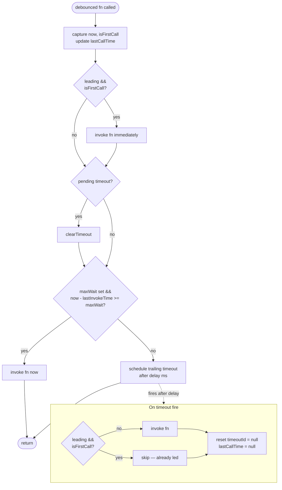

## Overview

This debounce delays calling `fn` until `delay` ms have passed since the last invocation, with two optional extensions: `leading` fires `fn` on the *first* call of a burst rather than the last, and `maxWait` caps how long `fn` can be suppressed under sustained load, giving throttle-like behavior as a floor.

## Diagram



## Breakdown

**Closed-over state**

Three variables survive across calls and carry state between invocations of the returned function:

| Variable | Initial | Meaning |
|---|---|---|
| `timeoutId` | `null` | Handle to the pending trailing timeout; `null` = nothing scheduled |
| `lastCallTime` | `null` | Timestamp of the most recent call; reset to `null` when debounce settles |
| `lastInvokeTime` | `0` | Timestamp of last actual `fn()` invocation; drives `maxWait` |

**`isFirstCall` — detecting burst boundaries**

```typescript
const isFirstCall = lastCallTime === null;
```

`lastCallTime` is `null` not just before the very first call, but also after the timeout resets it. This means `isFirstCall` is `true` at the start of *every* burst after a quiet period — each new burst gets fresh leading-edge behavior, not just the first call in the program's lifetime.

**Leading edge path**

```typescript
if (options.leading && isFirstCall) {
  invoke(args);
}
```

Fires `fn` immediately on the first call of a burst. The timeout is still scheduled after this, so trailing behavior remains in place for subsequent calls in the same burst.

**The debounce core — timeout cancellation**

```typescript
if (timeoutId !== null) {
  clearTimeout(timeoutId);
}
```

Every call cancels the previous pending timeout. This is the debounce mechanism: the trailing invocation can only fire if `delay` ms pass with zero new calls.

**maxWait path — the throttle floor**

```typescript
if (options.maxWait && now - lastInvokeTime >= options.maxWait) {
  invoke(args);
} else {
  timeoutId = setTimeout(...);
}
```

If `fn` hasn't been called in `maxWait` ms despite a continuous burst, invoke immediately rather than keep waiting. Under sustained load (e.g., scroll events firing every 16ms with `delay=500`), without `maxWait` `fn` would never fire. With `maxWait=1000`, `fn` is guaranteed to fire at least once per second regardless.

**Subtle issue here:** the `maxWait` branch calls `invoke` but does *not* reset `timeoutId = null`. After `clearTimeout`, the old handle is stale — calling `clearTimeout` on it again is harmless, but `timeoutId !== null` would give a false positive to anyone using it as a "pending call" sentinel. It's not a behavioral bug, but it's a latent readability hazard.

**Trailing timeout callback — the `isFirstCall` capture**

```typescript
timeoutId = setTimeout(() => {
  if (!options.leading || !isFirstCall) {
    invoke(args);
  }
  timeoutId = null;
  lastCallTime = null;
}, delay);
```

`isFirstCall` here is the **value captured when the debounced function was called**, not re-evaluated when the timeout fires. This distinction drives correct behavior across three cases:

| Mode | `isFirstCall` at call time | Timeout behavior |
|---|---|---|
| Leading, first call | `true` | `!isFirstCall = false` → skip (already invoked on leading) |
| Leading, non-first call | `false` | `!isFirstCall = true` → invoke trailing |
| Non-leading | any | `!options.leading = true` → always invoke trailing |

The `lastCallTime = null` reset at the end is the key to making the *next* burst recognize itself as a fresh start. Without it, leading mode would only trigger once ever, not once per burst.
